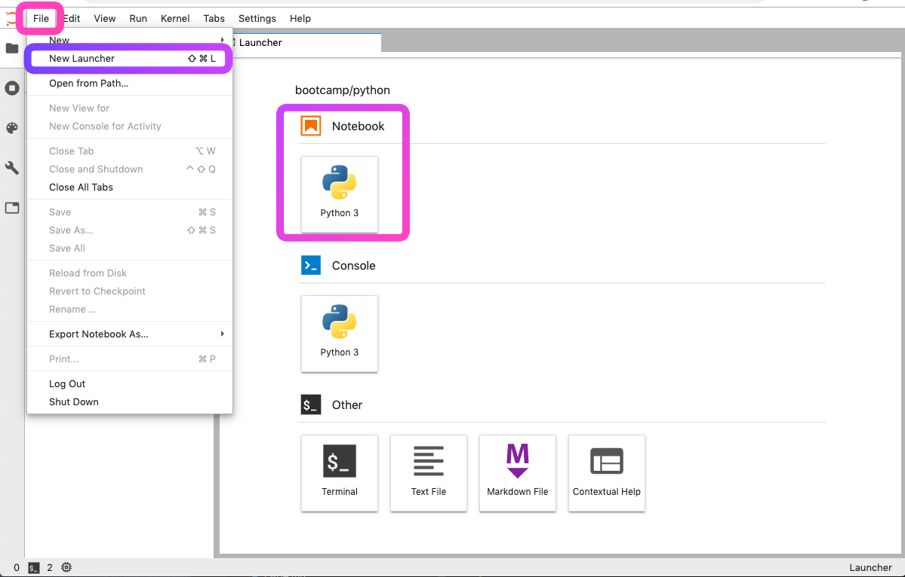
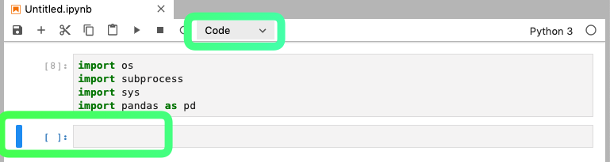
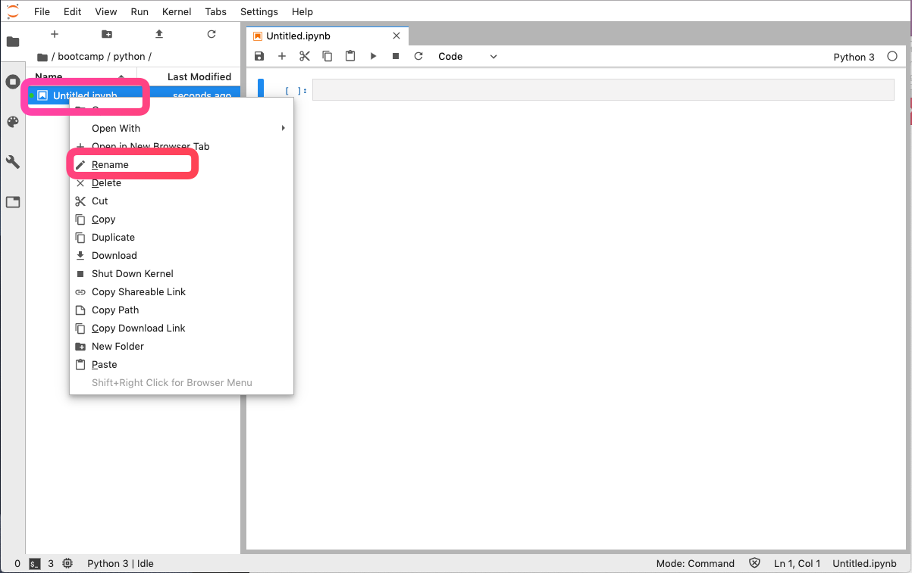
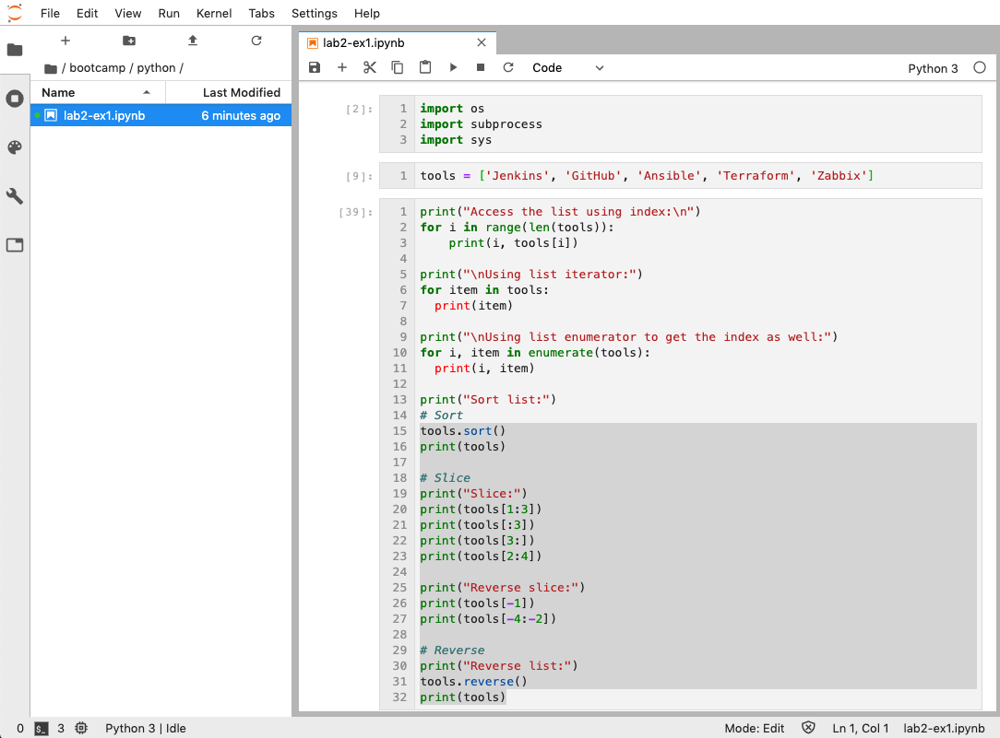
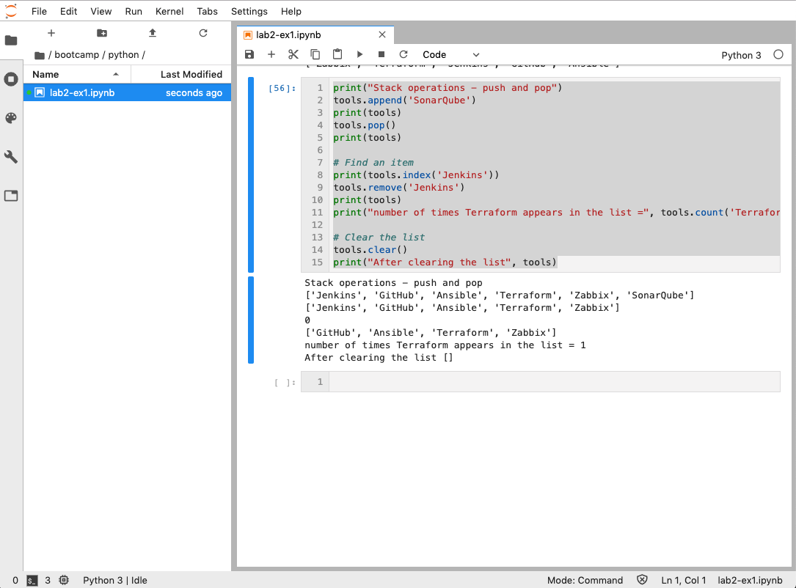
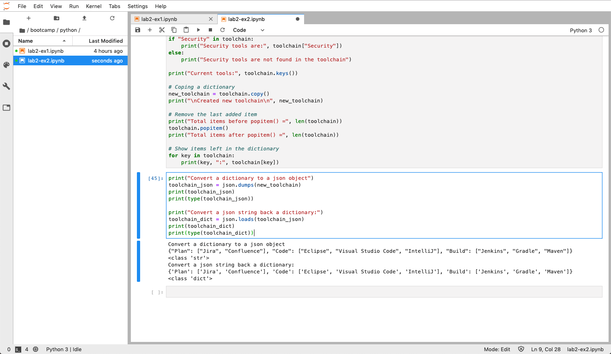

## Lab2 - Data Structures
---

### Introduction

Like other programming languages, data structures are ways Python organizing, storing, manipulating data. In this lab, you will learn how to use Python built in data types to store and manipulate data. We also learn how to use Jupyterlab, a modern web-based development interface for Python and data analysis.

To use Jupyterlab, select the menu File->New Laucher (Shift+Cmd+l) to open the Launcher from your Jupyterhub console. Then click on the Python notebook thumbnail to open a new Notebook.



A notebook is consisted of one or more cells. A cell can be used to write Python code, markdown text, or raw text. Nagivate the menu options and hover over the icons on the toolbar to get familiar with Jupyerlab.  



Inside or at the current cell, you can hit CTLR+Enter keys together or the *Play* icon to execute code in the current cell, or just to render the markdown text. To execute all cells, select from the menu,  Run->"Run All Cells". Use the '+' icon to insert a new cell, or the 'scissor' icon to delete the current cell. Hit the ESC keyboard key to exit the edit mode. Use arrow keys to move up or down the cells.


### Exercise 1 - List

List is the most common used data structure to hold a collection of mutable and ordered sequence of items. Each item in a list corresponds to an index number, starting with 0. For example,

```
tools = ['Jenkins', 'GitHub', 'Ansible', 'Terraform', 'Zabbix']
```

The index breakdown looks like this:

| 'Jenkins' | 'GitHub' | 'Ansible' | 'Terraform' | 'Zabbix' |
|:-------:|:------:|:-------:|:---------:|:-----:|
| 0 | 1 | 2 | 3 | 4|


1. First, rename the notebook to lab2-ex1.ipynb by right-clicking on the file to open the popup menu, then select *rename*. To show the line number inside a cell, select View->Show Line Numbers".
 


2. In the first cell, enter the following lines of code. Hit Shift-Enter keys together to execute the code in the cell. Jupyerlab will move to the next cell automatically. If you don't want to advance to the next cell, hit Ctrl-Enter keys instead. You can always re-execute code in a cell.

```
import os
import subprocess
import sys
```

3. Add a new cell to declare a list variable. Enter the line below and execute the code in the cell.

```
# declare a list variable
tools = ['Jenkins', 'GitHub', 'Ansible', 'Terraform', 'Zabbix']
```

4. There are different ways to access the items in the list. Create a new cell and try the following code in a cell. Press CTRL-Enter when ready to execute and see result outputs.

```
print("Access the list using index:\n")
for i in range(len(tools)):
    print(i, tools[i])

print("\nUsing list iterator:")
for item in tools:
  print(item)

print("\nUsing list enumerator to get the index as well:")
for i, item in enumerate(tools):
  print(i, item)

print("Sort list:")
# Sort
tools.sort()
print(tools)

# Reverse
print("Reverse list:")
tools.reverse()
print(tools)

# Slice
print("Slice:")
print(tools[1:3])
print(tools[:3])
print(tools[3:])
print(tools[2:4])
print(tools[-1])
print(tools[-2:])

```




5. List provides a set of functions to manipulate data. Add a new cell and paste the following lines of code.

```
print("Stack operations - push and pop")
tools.append('SonarQube')
print(tools)
tools.pop()
print(tools)

# Find an item
print(tools.index('Jenkins'))
tools.remove('Jenkins')
print(tools)
print("number of times Terraform appears in the list =", tools.count('Terraform'))

# Clear the list
tools.clear()
print("After clearing the list", tools)
```

Hit *Ctrl-Enter* keys together to execute the code and view the results.




6. You can combine two more lists using the '+' operator. For example,

```
x = [1, 3, 5, 7]
y = [2, 4, 6, 8]
z = x + y
print(z)
```

### Exercise 2 - Dictionary

A Dictionary is a data type similar to List, but works with keys and values instead of indexes. Each value stored in a dictionary can be accessed using a key instead of using its index to address it.. The value is any type of object (a string, a number, a list, etc.). To see how Dictionary works,

1. Create a new the notebook and rename the file to 'lab2-ex2.ipynb' by right clicking on the default Notebook file to open the popup menu, then select *rename*.

2. In the first cell, import the following modudes

```
import os
import subprocess
import sys
import json
```

3. Add a new cell and add the following lines of code. Then hit Shift-Enter to create the dictionary variable.

```
toolchain = {
    "Plan": ["Jira", "Confluence"],
    "Code": ["Eclipse", "Visual Studio Code", "IntelliJ"],
    "Build": ["Jenkins", "Gradle", "Maven"],
    "Test": ["JUnit", "Selenium", "SonarQube"],
    "Deploy": ["Jenkins", "Ansible"],
    "Monitor": ["Splunk", "Zabbix", "New Relic", "Grafana", "ELK", "Prometheus"]
}
```

4. To see how to accessing the dictionary items, try the following codes in the new cell. You can hit Ctrl-Enter to execute the code anytime to see the output.

```
# Looping through the dictionary keys
for key in toolchain:
    print(key, ":", toolchain[key])

# Another way to loop through the keys
for key in toolchain.keys():
    print(key, ":", toolchain[key])
    
# Accessing the values
for v in toolchain.values():
    print(v)

# Accessing both keys and values
for k, v in toolchain.items():
    print(k, ":", v)
```

Here are the methods commonly used to access the dictionary items.

```
clear()	Removes all the items
copy()	Returns a copy of the dictionary
get()	Returns the value for a given key
keys()	Returns a list keys
pop()	Removes the item with the specified key
popitem()	Removes the last inserted item
values()	Returns a list of all the values in the dictionary
```

5. In a new cell, try the following methods to add, modify, or delete items.

```
# Adding a new item
toolchain["Security"] = ["Qualys"]

if "Security" in toolchain:
    print("Security tools are:", toolchain["Security"])
else:
    print("Security tools are not found in the toolchain")

# Modifying an item
toolchain["Security"] = ["Qualys", "Firepower"]
print("Security tools added:", toolchain["Security"])

# Deleting items
toolchain.pop("Security")
if "Security" in toolchain:
    print("Security tools are:", toolchain["Security"])
else:
    print("Security tools are not found in the toolchain")
    
print("Current tools:", toolchain.keys())

# Coping a dictionary
new_toolchain = toolchain.copy()
print("\nCreated new toolchain\n", new_toolchain)

# Remove the last added item
print("Total items before popitem() =", len(toolchain))
toolchain.popitem()
print("Total items after popitem() =", len(toolchain))

# Show items left in the dictionary
for key in toolchain:
    print(key, ":", toolchain[key])
```

6. Converting a dictionary to a json object and vice versus

When consuming web application interface (REST API), you often need to convert a dictionary object to a JSON string or vice versa. You can use the methods in the **json** module imported. Try the following example code.

```
print("Convert a dictionary to a json object")
toolchain_json = json.dumps(new_toolchain)
print(toolchain_json)
print(type(toolchain_json))

print("Convert a json string back a dictionary:")
toolchain_dict = json.loads(toolchain_json)
print(toolchain_dict)
print(type(toolchain_dict))
```




### Exercise 3 - Tuple

A tuple is like a list except it is read only. Tuples are written with round brackets. Tuples are used to ensure items are not changed by other codes once it is defined in the global scope. Aside from that, it behaves like a list.

1. Create a new the notebook and rename the file to 'lab2-ex3.ipynb' by right clicking on the default Notebook file to open the popup menu, then select the *rename*.

2. In a new cell, add the follow lines of code to see how it works.

```
# Create a tuple variale
tool_tuple = ('Jenkins', 'GitHub', 'Ansible', 'Terraform', 'Zabbix')

# loop through the tuple items
print(type(tool_tuple))
for item in tool_tuple:
    print(item)
```

3. To show a tuple is not changeable, try the following code to change an item. You should get an error for each of the following operations.

```
tool_tuple.clear()
tool_tuple.pop()
tool_tuple.append("Rundeck")
del(tool_tuple[2])
tool_tuple[2] = "Chef"
```

### Exercise 4 - Set

While Tuple is ready only, a Set in Python is a collection that does not allow duplicate items. Set supports all List operatons, and additional methods for mathematical set operations - union, intersection, difference. 

1. Create a new the notebook and rename the file to 'lab2-ex4.ipynb' by right clicking on the default Notebook file to open the popup menu, then select the *rename*.

2. To learn how Set works, add a new cell and paste the following code:

```
# creating set variables
code = { "GitHub"}
build = { "Jenkins", "Gradle", "Maven"}
deploy = { "Jenkins", "Ansible"}
```

3. Next, add a new cell to try some set operations

```
# create an union set
all_tools = code.union(build).union(deploy)

print("Union:", all_tools)
print("Intersection: ", build.intersection(deploy))
print("Difference: ", build.difference(deploy))
print("Difference: ", deploy.difference(build))
```

```
print("Is code and build disjoint:", code.isdisjoint(build))
print("Is deploy and build disjoint:", deploy.isdisjoint(build))

x = {1, 2}
y = {1, 3, 2, 4, 5}

print("is x a subset of y:", x.issubset(y))
print("is y a subset of x:", y.issubset(x))
print("is y a superset of x:", y.issuperset(x))

y.discard(1)
print("After discard 1 from y, is y a superset of x:", y.issuperset(x))

for z in x.intersection(y):
    print(z)
```

4. Let's write this exercise as a Python script file and rut it.

Create a script file, lab2-ex4.py, and paste the following code into it.

```
#! /usr/bin/evn python3

import os
import subprocess
import sys

# create three sets
code = { "GitHub"}
build = { "Jenkins", "Gradle", "Maven"}
deploy = { "Jenkins", "Ansible"}

# create an union set
all_tools = code.union(build).union(deploy)


print("Union:", all_tools)
print("Intersection: ", build.intersection(deploy))
print("Difference: ", build.difference(deploy))
print("Difference: ", deploy.difference(build))

print("Is code and build disjoint:", code.isdisjoint(build))
print("Is deploy and build disjoint:", deploy.isdisjoint(build))

x = {1, 2}
y = {1, 3, 2, 4, 5}

print("is x a subset of y:", x.issubset(y))
print("is y a subset of x:", y.issubset(x))
print("is y a superset of x:", y.issuperset(x))

y.discard(1)
print("After discard 1 from y, is y a superset of x:", y.issuperset(x))

for z in x.intersection(y):
    print(z)
    
```

To run the script file, open a Terminal window and execute the following commands:

```console
$ chmod u+x lab2-ex4.py
$ python3 lab2-ex4.py
$ ./lab2-ex4.py
```


### Exercise 5 - Pandas

In this exercise, we will introduce Pandas. Pandas is data structure and analysis tool for Python very much like Excel. It is very popular in the data science world. You can use Pandas to

* Import and export with different formats - CSV, Excel, JSON, SQL database.
* Reshaping and pivoting data.
* Slicing, indexing, and subsetting large data sets.
* Merging, joining, aggregating and grouping data

The two primary data structures of Pandas, Series (array) and DataFrame (table), handle the majority of typical use cases in finance, statistics, and many areas of engineering. In this exercise, we will learn some of the common Pandas operations. 

1. Create a new the notebook and rename the file to 'lab2-ex5.ipynb' by right clicking on the default Notebook file to open the popup menu, then select the *rename*.

2. In the first cell, add the following of lines of code code to import the required moudules.

```
import os
import subprocess
import sys
import datetime
import requests
import pandas as pd
import matplotlib.pyplot as pyplot
```

3. Add a new cell to load some historical stock prices into dataframe objecs.

```
# Load data into dataframe variables from local and remote data sources
fb = pd.read_csv("https://mpt-public.s3-us-west-2.amazonaws.com/data/FB.csv")
appl = pd.read_json("https://mpt-public.s3-us-west-2.amazonaws.com/data/AAPL.json")
csco = pd.read_csv("data/CSCO.csv", index_col=0, parse_dates=True)
msft = pd.read_csv("data/MSFT.csv", index_col=0, parse_dates=True)
```

4. To view the data, append a new cell and use one of the following methods.

```
# show the first n rows
fb.head(2)
```

```
# show the last 5 rows
msft.tail()
```

```
# shows a quick statistic summary 
appl.describe()
```

```
# transposing selected data:
csco.head(5).T
```

5. Pandas provides various methods to select data storing in the DataFrame.

Append a new cell for each of selection operations.

```
# selecting columns
appl[["Open", "Close"]]
```

```
# selecting rows
appl[5:10]
```

```
# selecting rows and columns
appl.loc[[1,3,5], ["Open","Close"]]

```

```
# selection by conditions
appl[(appl.Open > 240.0) & (appl['Volume'] > 30000000)]
```

6. Grouping and aggregation

With DataFrame, you can easily group data together and aggregate them. Add and run the following cells.

```
# create a year and month columns for aggregation
# csco and msft were loaded as time series, therefore can easily create new column from the date index column
csco['Year'] = csco.index.year
csco['Month'] = csco.index.month
```

```
# compute average by year and month
csco.groupby(["Year", "Month"]).mean()
```

```
# compute max by year and month
csco.groupby(["Year", "Month"]).max()
```

```
# show the high and low line chart and save it
lines = fb[['High','Low']].plot.line()
pyplot.savefig('data/FB-high-low.png')
```

### Conclusion

In this lab, we went through the built in Python data structures and common operations. We also introduce how to use Pandas to perform more advance data manipulation and analysis. You can learn more about Pandas by visiting the [Pandas](https://pandas.pydata.org/pandas-docs/version/0.25/index.html) website.


